# Gen Optim Structures

Here's an ESAPI script that will create planning and optimization structures based on anatomical structures. The script is developed to be a binary plugin, which means it could be run when the patient and their initial structure set is loaded into Eclipse. We provide a guide on how to:

1. Run Binary Plugin
2. Compile the Binary Plugin
3. Develope the Plugin Further

Please note that the script was built to work for any treatment site and structure creation guideline. However, the users are required to provide the structure creation guideline as a .json template file. See section 4. Structure Creation Template for more details.

To get started, either clone the repo or download it from [https://github.com/hosseinjafar/gen_optimization_structures.git](https://github.com/hosseinjafar/gen_optimization_structures.git)

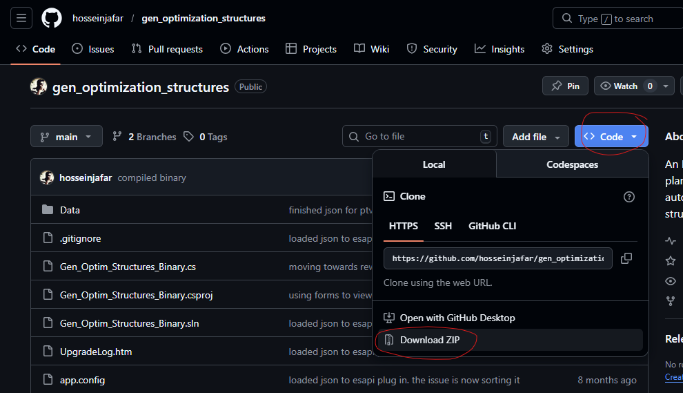

Extract the content into a directory that is accessible to Eclipse. We recommend the stanadard`Documents\` location.

## Run Binary Plugin

1. Extract the contents of compiled.esapi.zip and veify the following files exist in the extracted location. These are the binaries required:
   1. `Gen_Optim_Structures_Binary.esapi.dll`
   2. `Gen_Optim_Structures_Binary.esapi.dll.config`
   3. `Gen_Optim_Structures_Binary.esapi.pdb`
   4. `Newtonsoft.Json.dll`
   5. `Newtonsoft.Json.xml`

2. Open Eclipse and load the patient with their initial structure set 

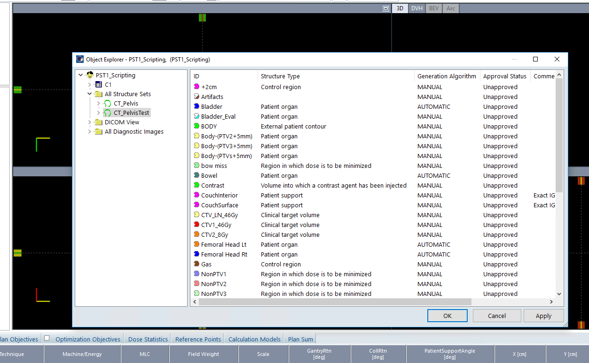

2. Load the script by going to `Tools/Scripts...`

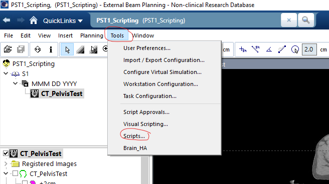

Then, Click on Change folder and navigate to where the extracted binaries from step 1 are stored. Click Open after

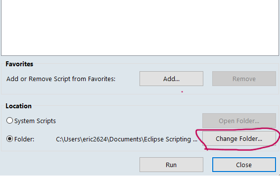

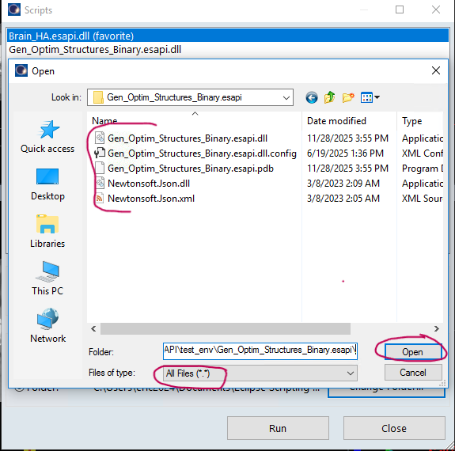

3. Now select the script `Gen_Optim_...` and click run:

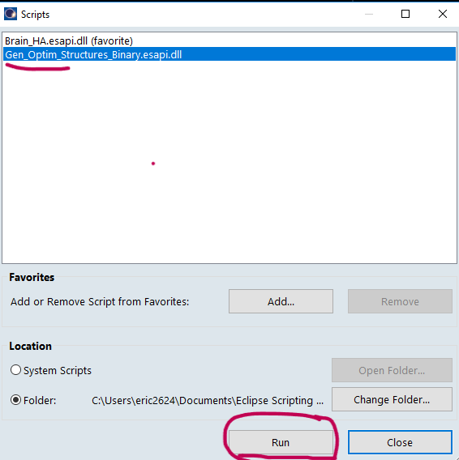

A pop up window will open asking you to guide you to the structure creation template file. The location is `Documents\gen_optimization_structures\Data`. Here you'll see a few of our predefined templates. You'll likely make one for your center.

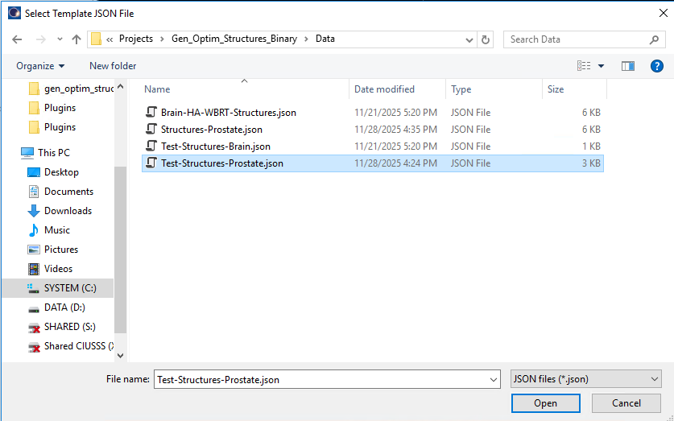

After you select the template file, you'll get a confirmation that the structure relations file was found. click ok

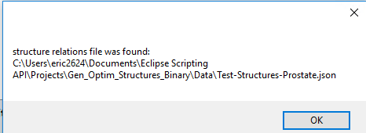

Then you'll get a message saying the number of structures loaded from your initial plan. click ok.

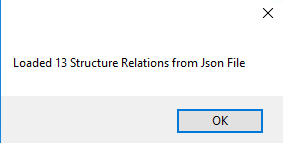

Then, a window will popup showing all the structures (old and the new) as well as their resolution. Once you close this window, the context on Eclipse will get updated with the new structures created.

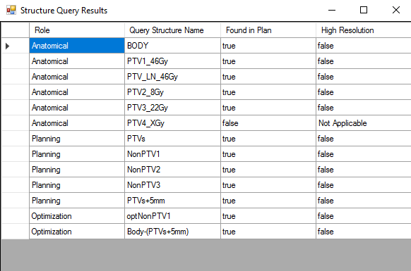

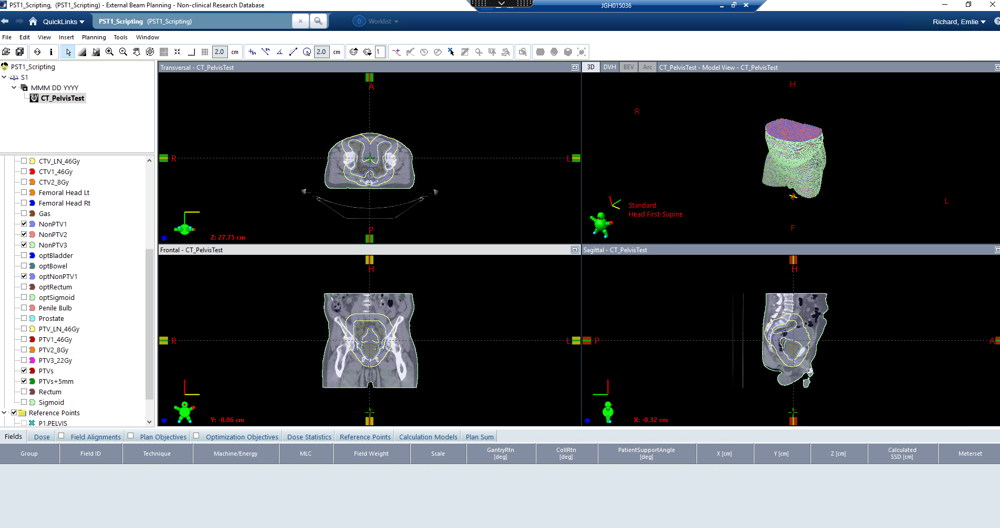

## Compile the Binary Plugin

## Develope the Pluging

## Structure Creation Template